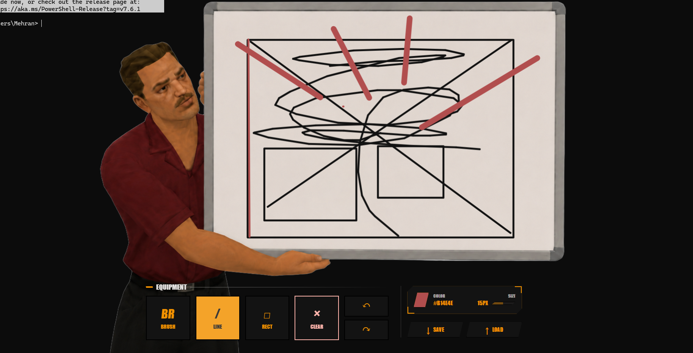

# Funny Whiteboard

A transparent Tauri desktop paint app where a character holds the drawable whiteboard. The window is borderless, resizable, and uses a transparent background so other windows show behind the mascot image.

## Preview



## Features

- Draw directly inside the whiteboard area
- Brush, line, and rectangle tools
- Text tool with multiline typing, color, size, bold, and italic controls
- Shared drawing and text color controls
- Separate stroke and text size settings
- Undo and redo
- Save and load PNG drawings from `saved_images/`
- Replace the mascot PNG next to the `.exe` without rebuilding
- Transparent, borderless Tauri window
- Custom app icon/logo

## Requirements

- [Bun](https://bun.sh/)
- [Rust](https://www.rust-lang.org/tools/install)
- Windows WebView2 runtime
- Tauri system dependencies for your OS

## Install

```powershell
bun install
```

## Run In Development

```powershell
bun run tauri dev
```

For frontend-only development:

```powershell
bun run dev
```

## Build

Build the Windows x64 executable without creating an installer:

```powershell
bun run tauri build --target x86_64-pc-windows-msvc --no-bundle
```

The plain executable is created at:

```text
src-tauri/target/x86_64-pc-windows-msvc/release/funny_whiteboard.exe
```

The default local build still creates every bundle configured in `src-tauri/tauri.conf.json`:

```powershell
bun run tauri build
```

Build outputs are created in:

```text
src-tauri/target/release/
src-tauri/target/release/bundle/
```

Main Windows artifacts:

```text
src-tauri/target/release/funny_whiteboard.exe
src-tauri/target/release/bundle/nsis/funny_whiteboard_0.1.0_x64-setup.exe
src-tauri/target/release/bundle/msi/funny_whiteboard_0.1.0_x64_en-US.msi
```

## CI And Releases

Pull requests and pushes to `main` build and validate an unsigned Windows x64 executable. The CI artifact filename includes the commit SHA and is retained for 14 days.

Push a stable version tag matching every application version to create a draft GitHub Release:

```powershell
git tag v0.1.0
git push origin v0.1.0
```

Before tagging, keep these versions identical:

```text
package.json
src-tauri/Cargo.toml
src-tauri/tauri.conf.json
```

The release workflow publishes exactly one draft asset:

```text
funny-whiteboard-0.1.0-windows-x64.exe
```

Download the executable to a writable folder and run it directly. There is no installer or uninstaller; delete the executable to remove it. Windows WebView2 must already be installed. The executable is intentionally unsigned for now, so Windows SmartScreen or antivirus software may display a warning.

Test the draft executable on a clean Windows x64 machine before manually publishing the release. The legacy `1.0` tag does not match the current application version and must not be moved or reused.

## Change Mascot Without Rebuilding

Put a transparent PNG named `held-whiteboard.png` in the same folder as `funny_whiteboard.exe`:

```text
src-tauri/target/release/held-whiteboard.png
```

The app loads that file on startup. If it is missing, the built-in image from `src/assets/held-whiteboard.png` is used.

## Project Structure

```text
src/                         Frontend drawing UI
src/assets/held-whiteboard.png
src-tauri/                   Tauri and Rust backend
src-tauri/icons/             App icon assets
src-tauri/saved_images/      Default saved drawing folder
```

## Notes

- Drag the window from outside the drawing board area.
- Resize from the window edges.
- With the Text tool selected, click the board to type. Press `Ctrl+Enter` or `Cmd+Enter` to place the text and `Escape` to cancel it.
- Placed text becomes part of the PNG drawing; use undo and retype it to make changes.
- The held whiteboard image must keep real PNG transparency around the character and board.
